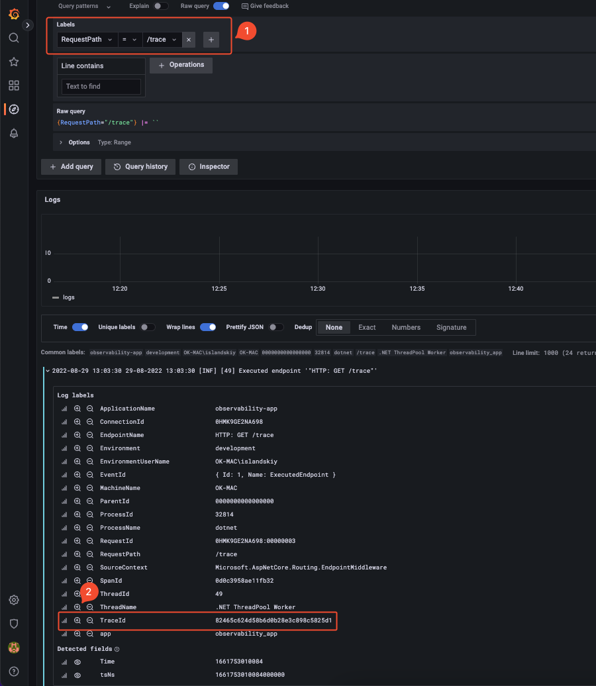
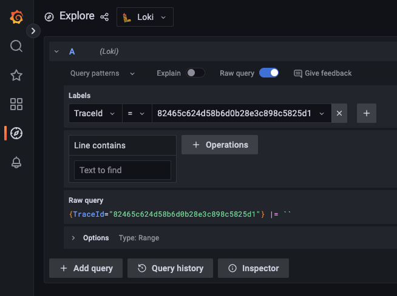
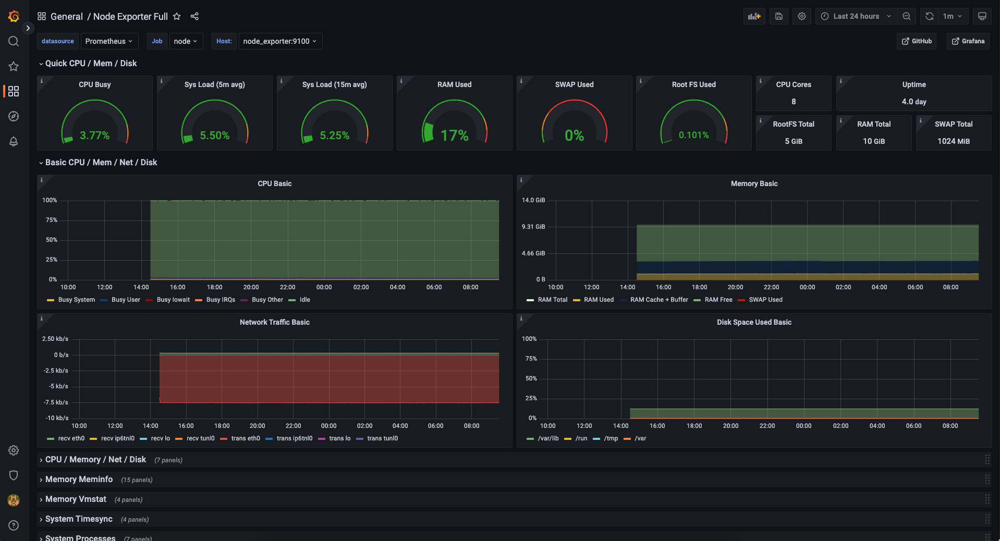
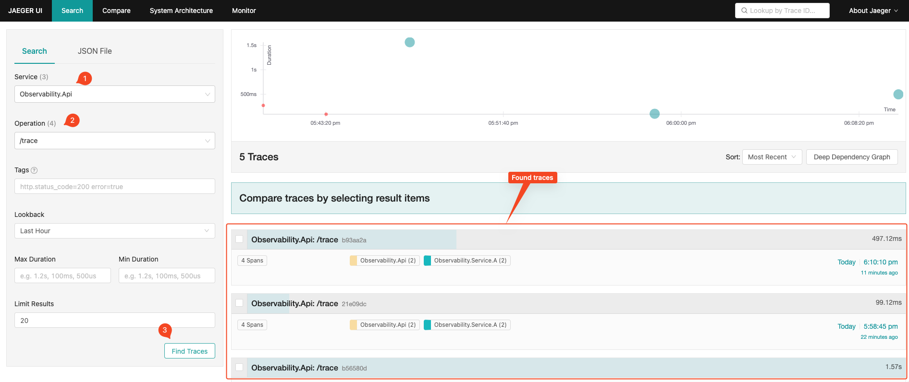
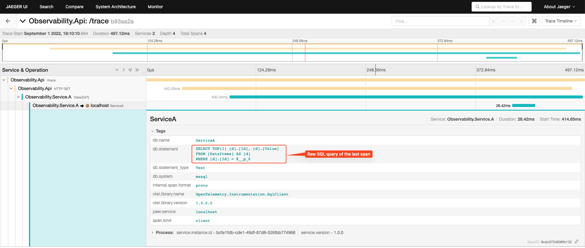

## Prerequisites

1. Start docker-compose file from the repository root:
   ```shell
   docker-compose -f docker-compose.yml up
   ```
   This command runs all required infrastructure:
   - Grafana
   - Grafana Loki
   - Promtail
   - Prometheus
   - Prometheus Node Exporter
   - Jaeger
2. Open Grafana web page at http://localhost:3000 and login (default credentials are admin/admin)
3. Navigate to Configuration -> "Data sources" and add Loki data source. Specify just the Loki URL (http://loki:3100) and save the data source
4. Navigate to Configuration -> "Data sources" and add Prometheus data source. Specify Prometheus URL (http://prometheus:9090) and save the data source
5. Start the app and make a request
6. Log messages should become visible in "Explore" tab in Grafana

## Scenario: logs correlation between services

To have a link between services logs during communications we need to have some Correlation ID (TraceID in terms of OpenTelemetry or Microsoft Diagnostics Activity API). As a part of OpenTelemetry tracing setup the TraceId is already provided. But is not considered by Serilog during enrichment process.
To add TraceID into logging context the [Serilog.Enrichers.Span](https://github.com/RehanSaeed/Serilog.Enrichers.Span) Nuget package could be used.

1. Make GET request to https://localhost:7248/trace to trigger cross service logging
2. Go to Grafana "Explorer" tab and filter logs with {RequestPath = "/trace"}:

3. Open any log and add TraceId value to the query by clicking on zoom icon near the TraceId label. Then remove RequestPath filter criterion
4. Run query to get log messages of all services with the specific TraceId


## Scenario: view host metrics
For this scenario the following tools are required:
- [Prometheus Node Exporter](https://prometheus.io/docs/guides/node-exporter/) installed on target host and collects metrics
- Prometheus itself to store collected metrics
- Grafana to see the metrics

:exclamation: **Caution: for demo purposes we setup the exporter as docker container. That means the host metrics comes from Docker VM on Windows & Mac, but not the host system on bare metal**

As a base point of host metrics dashboard import the [Node Exporter Full dashboard](https://grafana.com/grafana/dashboards/1860-node-exporter-full/) via Dashboards -> +Import menu



## Scenario: trace apps communication (including SQL queries)
This scenario requires the following tool set:
- Jaeger as a trace store and UI (runs in docker)
- OpenTelemetry nuget packages to hook on ASP.NET Core/SQL request handling events and send trace spans to Jaeger

#### Tracing demo
1. Make GET request to https://localhost:7248/trace to trigger sending trace data
2. Open Jaeger UI on http://localhost:16686/search
3. Select the service 'Observability.API', then select the operation '/trace' (which was done in step 1) and click on 'Find Traces'. You will see the result similar to the depicted below:

5. Click on trace to see details including SQL query:


## Scenario: catch app errors in Sentry
TBD

## 

## Expose metrics with OpenTelemetry, Prometheus and Grafana
1. Install OpenTelemetry metrics Nuget package along with required instrumentation libraries and Prometheus exporter:
```shell
dotnet add package OpenTelemetry.Extensions.Hosting --prerelease
dotnet add package OpenTelemetry.Exporter.Prometheus.AspNetCore --prerelease 
dotnet add package OpenTelemetry.Instrumentation.Runtime --prerelease 
```
2. Register OpenTelemetry metrics services:
```csharp
builder.Services.AddOpenTelemetryMetrics(meterProviderBuilder =>
                                         {
                                             // Allow export metrics from the specified meter
                                             meterProviderBuilder.AddMeter("MyApp");
                                             // Appends ASP.NET Core specific metrics (http_server_duration_ms)
                                             meterProviderBuilder.AddAspNetCoreInstrumentation();
                                             // Appends .NET runtime metrics (GC allocation, threads count, ...)
                                             meterProviderBuilder.AddRuntimeInstrumentation();
                                             // Allow export metrics in Prometheus style (pull approach via /metrics endpoint) 
                                             meterProviderBuilder.AddPrometheusExporter();
                                         });
```
3. Add Prometheus exporter middleware to the pipeline:
```csharp
app.UseOpenTelemetryPrometheusScrapingEndpoint();
```
This exposes **/metrics** endpoint
4. Create custom metrics if needed. See counter example in **MetricsDemoController** or histogram in **RequestDurationMiddleware**
5. Start the Observability.API project
6. Make a request to **/metrics-demo/counter** with custom counter metric example
7. Navigate to **/metrics** endpoint to see current app metrics

### Sources
- https://grafana.com/docs/grafana-cloud/quickstart/docker-compose-linux/